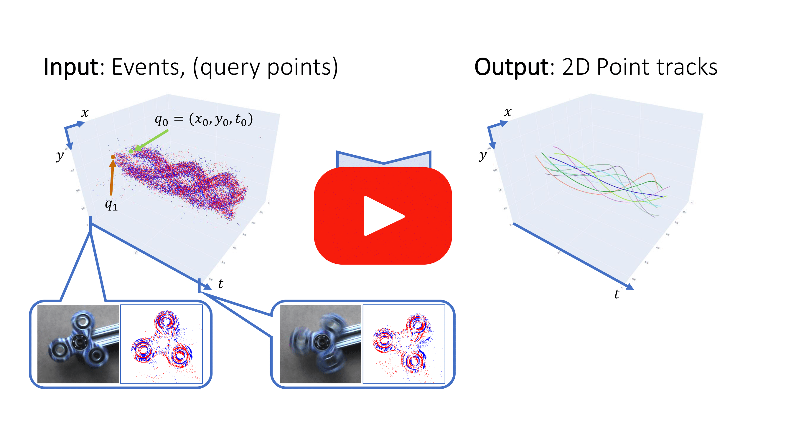
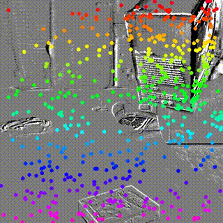
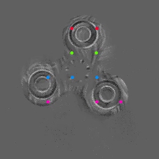

# ETAP: Event-based Tracking of Any Point

[](https://arxiv.org/pdf/2412.00133)
[](https://drive.google.com/drive/folders/1Mprj-vOiTP5IgXE9iuu4-4bazcZUswpp?usp=drive_link)
[](https://youtu.be/LaeA9WJ7ptc)
[](https://creativecommons.org/licenses/by-nc/4.0/)

## Introduction

This is the official repository for [**ETAP: Event-based Tracking of Any Point**](https://arxiv.org/pdf/2412.00133), accepted at **CVPR 2025**, by [Friedhelm Hamann](https://friedhelmhamann.github.io/), [Daniel Gehrig](https://danielgehrig18.github.io/), [Filbert Febryanto](https://github.com/filbert14), [Kostas Daniilidis](https://www.cis.upenn.edu/~kostas/) and [Guillermo Gallego](http://www.guillermogallego.es/).

<p align="center">
 <a href="https://youtu.be/LaeA9WJ7ptc">
  
 </a>
</p>

### Key Features

- The first event-only point tracking method with strong cross-dataset generalization.
- Robust tracking in challenging conditions (high-speed motion, lighting changes).
- Evaluation benchmark based on six event camera datasets: EDS, EC, EVIMO2, EventKubric, E2D2 and PennAviary

### Example Predictions

<div align="center">
  <table>
    <tr>
      <td align="center">
        
        <br>Example 1: Synthetic dataset EventKubric
      </td>
      <td align="center">
        
        <br>Example 2: Feature Tracking on EDS
      </td>
    </tr>
    <tr>
      <td align="center">
        
        <br>Example 3: E2D2
      </td>
      <td align="center">
        
        <br>Example 4: EVIMO2
      </td>
    </tr>
  </table>
</div>

## Table of Contents

- [Quickstart Demo](#quickstart-demo)
- [Installation](#installation)
- [Model Selection](#model-selection)
- [Evaluation Tasks](#evaluation-tasks)
  - [Feature Tracking (EDS, EC)](#feature-tracking-eds-ec)
  - [EVIMO2](#evaluation-evimo2)
  - [EventKubric](#evaluation-eventkubric)
  - [E2D2](#evaluation-e2d2)
  - [PennAviary](#evaluation-pennaviary-qualitative)
- [Synthetic Data Generation](#synthetic-data-generation-eventkubric)
- [Acknowledgements](#acknowledgements)
- [Citation](#citation)
- [Additional Resources](#additional-resources)
- [License](#license)

## Quickstart Demo

The quickest way to try ETAP is using our demo:

1. Clone the repository:
   ```bash
   git clone https://github.com/tub-rip/ETAP.git
   cd ETAP
   ```

2. Download [the model weights](https://drive.google.com/file/d/18mnwu8CsrVJvDXeRtvU0Wgp6shdxn0HD/view?usp=drive_link) and save to `weights/ETAP_v1_cvpr25.pth`
3. Download [the demo example](https://drive.google.com/drive/folders/1d5Yi1q6ZFom3Q_VrELzXjrxE5aC2ezOk?usp=drive_link) (30MB) and extract to `data/demo_example`
4. Run the demo:
   ```bash
   python scripts/demo.py
   ```

This demo requires only basic dependencies: `torch`, `numpy`, `tqdm`, `matplotlib`, `imageio`, and `pillow`. No dataset preprocessing needed!

## Installation

1. Clone the repository:
   ```bash
   git clone git@github.com:tub-rip/ETAP.git
   cd ETAP
   ```

2. Set up the environment:
   ```bash
   conda create --name ETAP python=3.10
   conda activate ETAP
   ```

3. Install PyTorch (choose a command compatible with your CUDA version from the [PyTorch website](https://pytorch.org/get-started/locally/)), e.g.:
   ```bash
   conda install pytorch torchvision pytorch-cuda=12.1 -c pytorch -c nvidia
   ```

4. Install other dependencies:
   ```bash
   pip install -r requirements.txt
   ```

## Model Selection

Download the [pre-trained model](https://drive.google.com/drive/folders/17YNqf603b3dEdETmNht-ih7cwosKyACN?usp=drive_link) and move it into the folder `<repo-root>/weights/`. 

To reproduce the paper results, use the model `ETAP_v1_cvpr25.pth`.

## Evaluation Tasks and Datasets

### Evaluation: Feature Tracking (EDS, EC)

#### Preparations

##### Download EDS (Prophesee Gen3 640 x 480 px)

Download the four evaluation sequences of the "Event-aided Direct Sparse Odometry Dataset" (EDS) from the [official web page](https://rpg.ifi.uzh.ch/eds.html):

* `01_peanuts_light`
* `02_rocket_earth_light`
* `08_peanuts_running`
* `14_ziggy_in_the_arena`

Choose the pocolog option, which contains the events as an hdf5 file. Place all sequences in a common folder.

We also use the calibration data provided by EDS. No action is required, as it is included in this repository at `config/misc/eds/calib.yaml`. This is the same file as in the `00_calib` results from the official source.

The evaluation was introduced in [DDFT](https://github.com/uzh-rpg/deep_ev_tracker). As with the calibration data, we have hardcoded the ground truth tracks at `/config/misc/eds/gt_tracks`, so no additional steps are necessary. If you are interested in how the tracks are created, please refer to the DDFT repository.

Create a symbolic link to your data root into `<repository-root>/data`, or alternatively you can change the paths in the config files. The setup should look something like this:

```
data/eds/
   ├── 01_peanuts_light
   │   └── events.h5
   ├── 02_rocket_earth_light
   │   └── events.h5
   ├── 08_peanuts_running
   │   └── events.h5
   └── 14_ziggy_in_the_arena
      └── events.h5
```

##### Download EC (DAVIS240C 240 x 180 px)

Download the five evaluation sequences of the "Event Camera Dataset" (EC) from the [official source](https://rpg.ifi.uzh.ch/davis_data.html). Download the option `Text (zip)`. Unzip the sequences into a folder structure like this:

```
data/ec/
   ├── boxes_rotation
   │   ├── calib.txt
   │   ├── events.txt
   │   ├── groundtruth.txt
   │   ├── images
   │   ├── images.txt
   │   └── imu.txt
   ├── boxes_translation
   │   ├── events.txt
   │   ├── ...
   ├── shapes_6dof
   │   ├── events.txt
   │   ├── ...
   ├── shapes_rotation
   │   ├── events.txt
   │   ├── ...
   └── shapes_translation
       ├── events.txt
       ├── ...
```

As with EDS, the ground truth tracks are from the evaluation introduced in DDFT but we have included them at `config/misc/ec/gt` for convenience.

##### Preprocessing

Preprocess the data by transforming the raw events into event stacks with the following commands:

```bash
# For EDS dataset
python scripts/prepare_event_representations.py --dataset eds --config config/exe/prepare_event_representations/eds.yaml

# For EC dataset
python scripts/prepare_event_representations.py --dataset ec --config config/exe/prepare_event_representations/ec.yaml
```

#### Inference

Run the tracking inference with:

```bash
python scripts/inference_online.py --config config/exe/inference_online/feature_tracking.yaml
```

#### Evaluation

Run the benchmarking script to evaluate the tracking results:

```bash
python scripts/benchmark_feature_tracking.py feature_tracking_eds_ec
```

### Evaluation: EVIMO2 (Samsung DVS Gen3 640 x 480 px)

#### Preparations

1. Download the required EVIMO2 sequences from the [official source](https://better-flow.github.io/evimo/download_evimo_2.html#imo). You only need **Motion Segmentation / Object Recognition** sequences for the **samsung_mono** camera in **.npz** format (2.4GB). Unzip them and move them into the data directory.

2. Download the precomputed tracks [here](https://drive.google.com/drive/folders/1d5Yi1q6ZFom3Q_VrELzXjrxE5aC2ezOk?usp=drive_link) and merge them into the data directory.

The result should look like this:

```
data/evimo/
└── samsung_mono
    └── imo
        └── eval
            ├── scene13_dyn_test_00_000000
            │   ├── dataset_classical.npz
            │   ├── dataset_depth.npz
            │   ├── dataset_events_p.npy
            │   ├── dataset_events_t.npy
            │   ├── dataset_events_xy.npy
            │   ├── dataset_info.npz
            │   ├── dataset_mask.npz
            │   └── dataset_tracks.h5
            ├── scene13_dyn_test_05_000000
            │   ├── dataset_classical.npz
            ... ...
```

3. Precompute the event stacks:

```bash
python scripts/prepare_event_representations.py --dataset evimo2 --config config/exe/prepare_event_representations/evimo2.yaml
```

#### Inference & Evaluation

Run inference and evaluation with a single command:

```bash
python scripts/inference_offline.py --config config/exe/inference_offline/evimo2.yaml
```

#### Ground Truth Track Generation (Optional)

If you want to generate the point tracks yourself instead of using the precomputed ones:

```bash
python scripts/create_evimo2_track_gt.py --config config/misc/evimo2/val_samples.csv --data_root data/evimo2
```

### Evaluation: EventKubric (synthetic 512 x 512 px)

#### Preparations

1. Download [the event_kubric test set](https://drive.google.com/drive/folders/1d5Yi1q6ZFom3Q_VrELzXjrxE5aC2ezOk?usp=drive_link) and move it to the data directory:

```
data/event_kubric
└── test
    ├── sample_000042
    │   ├── annotations.npy
    │   ├── data.hdf5
    │   ├── data_ranges.json
    │   ├── events
    │   │   ├── 0000000000.npz
    │   │   ├── 0000000001.npz
    │   │   ...
    │   ├── events.json
    │   └── metadata.json
    ├── sample_000576
    │   ├── annotations.npy
    │   ...
    ...
```

2. Prepare the event stacks:

```bash
python scripts/prepare_event_representations.py --dataset event_kubric --config config/exe/prepare_event_representations/event_kubric.yaml
```

#### Inference & Evaluation

Run inference and evaluation with a single command:

```bash
python scripts/inference_offline.py --config config/exe/inference_offline/event_kubric.yaml
```

### Evaluation: E2D2 (SilkyEvCam 640 x 480 px)

#### Preparations

1. Download [the E2D2 fidget spinner sequence](https://drive.google.com/drive/folders/1d5Yi1q6ZFom3Q_VrELzXjrxE5aC2ezOk?usp=drive_link) and move it to the data directory:

```
data/e2d2/
└── 231025_110210_fidget5_high_exposure
    ├── gt_positions.npy
    ├── gt_timestamps.npy
    ├── queries.npy
    └── seq.h5
```

2. Prepare the event stacks:

```bash
python scripts/prepare_event_representations.py --dataset e2d2 --config config/exe/prepare_event_representations/e2d2.yaml
```

#### Inference

```bash
python scripts/inference_online.py --config config/exe/inference_online/e2d2.yaml
```

#### Evaluation

```bash
python scripts/benchmark_tap.py --gt_dir data/e2d2/231025_110210_fidget5_high_exposure --pred_dir output/inference/tap_e2d2
```

#### Ground Truth Generation (Optional)

The ground truth is calculated from the turning speed of the fidget spinner and is provided for download. To calculate the ground truth tracks yourself, run:

```bash
python scripts/create_e2d2_fidget_spinner_gt.py
```

### Evaluation: PennAviary (SilkyEvCam 640 x 480 px, Qualitative)

#### Preparations

Download [the penn_aviary sequence](https://drive.google.com/drive/folders/1d5Yi1q6ZFom3Q_VrELzXjrxE5aC2ezOk?usp=drive_link) and move it to the data directory:

```
data/penn_aviary/
└── 231018_174107_view2
    ├── mask00082.png
    └── seq.h5
```

#### Inference

Run the inference with:

```bash
python scripts/inference_online.py --config config/exe/inference_online/penn_aviary.yaml
```

## Synthetic Data Generation (EventKubric)

We provide a [10 sample test set of EventKubric](https://drive.google.com/drive/folders/1d5Yi1q6ZFom3Q_VrELzXjrxE5aC2ezOk?usp=drive_link) for quick evaluation. The complete dataset consists of approximately 10,000 samples.

To generate your own synthetic event data, please refer to the [Data Pipeline Instructions](data_pipeline/README.md).

## Acknowledgements

We gratefully appreciate the following repositories and thank the authors for their excellent work:

- [CoTracker](https://github.com/facebookresearch/co-tracker)
- [TapVid](https://github.com/google-deepmind/tapnet/tree/main/tapnet/tapvid)
- [DDFT](https://github.com/uzh-rpg/deep_ev_tracker)

## Citation

If you find this work useful in your research, please consider citing:

```bibtex
@InProceedings{Hamann25cvpr,
  author={Friedhelm Hamann and Daniel Gehrig and Filbert Febryanto and Kostas Daniilidis and Guillermo Gallego},
  title={{ETAP}: Event-based Tracking of Any Point},
  booktitle={{IEEE/CVF} Conf. Computer Vision and Pattern Recognition ({CVPR})},
  year=2025,
}
```

## Additional Resources

* [Research page (TU Berlin, RIP lab)](https://sites.google.com/view/guillermogallego/research/event-based-vision)
* [Course at TU Berlin](https://sites.google.com/view/guillermogallego/teaching/event-based-robot-vision)
* [Survey paper](http://rpg.ifi.uzh.ch/docs/EventVisionSurvey.pdf)
* [List of Event-based Vision Resources](https://github.com/uzh-rpg/event-based_vision_resources)

## License

This project is licensed under the Creative Commons Attribution-NonCommercial 4.0 International License - see the [LICENSE](LICENSE) file for details. This means you are free to share and adapt the material for non-commercial purposes, provided you give appropriate credit and indicate if changes were made.