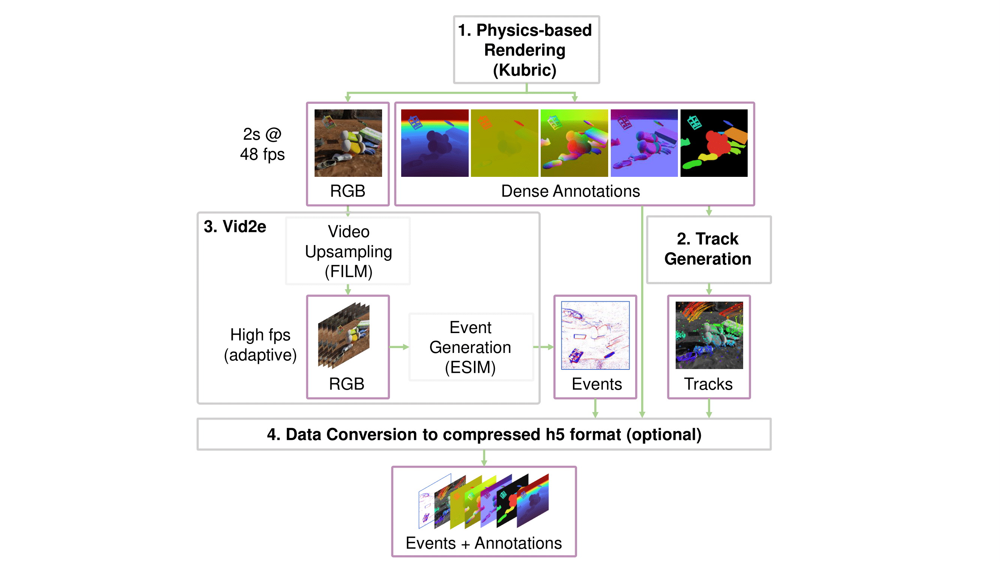

# EventKubric Data Generation Pipeline

## Overview

This document provides instructions for generating synthetic data samples for the EventKubric dataset. The pipeline leverages two key tools:
- [Kubric](https://github.com/google-research/kubric) - For generating synthetic scenes and rendering frames
- [Vid2E](https://github.com/uzh-rpg/rpg_vid2e) - For converting video frames to event data

Both tools are included as Git submodules in this repository. To access them, you can either:

Clone with the `--recursive` flag (if starting fresh):
```bash
git clone --recursive git@github.com:tub-rip/ETAP.git
```

Or if you've already cloned the repository without the `--recursive` flag, initialize and update the submodules:
```bash
# Navigate to your existing repository
cd ETAP

# Initialize and fetch all submodules
git submodule update --init --recursive
```

For reference samples, see the [EventKubric test set](https://drive.google.com/drive/folders/1v8dYA-D7OOCAw9TimTxj74nz8t5mbsqz).

## Data Generation Pipeline

### 1. Setting Up Kubric

#### CPU Setup (Standard)
Pull the Kubric Docker image:
```bash
docker pull kubricdockerhub/kubruntu
```

Set up and enter Docker container:
```bash
docker run --interactive --user $(id -u):$(id -g) --volume "$(pwd):/kubric" kubricdockerhub/kubruntu
sudo docker exec -it <container_id> bash
```

#### GPU Setup (Optional, for faster rendering)
Inside the `/kubric` directory:
1. Build the wheel file:
   ```bash
   python setup.py bdist_wheel
   ```

2. Build Docker images with GPU support:
   ```bash
   docker build -f docker/Blender.Dockerfile -t kubricdockerhub/blender-gpu:latest .
   docker build -f docker/Kubruntu.Dockerfile -t kubricdockerhub/kubruntu-gpu:latest .
   ```

3. Run container with GPU access:
   ```bash
   docker run --interactive --gpus all --env KUBRIC_USE_GPU=1 --volume "$(pwd):/kubric" kubricdockerhub/kubruntu-gpu
   sudo docker exec -it <container_id> bash
   ```

### 2. Generating Synthetic Samples

The complete pipeline consists of four main steps as visualized in the flow chart:

<p align="center">
  
</p>

#### Step 1: Generate Training Examples
```bash
python3 sample.py --output_dir=<output_dir> --start_index=<start_index> --end_index=<end_index> --worker_script=event_kubric_worker
```
This generates `end_index - start_index` training examples with indices in the range `[start_index, end_index - 1]`.

**Optional flags:**
- `--panning`: Include camera panning motions (similar to [TAPIR](https://deepmind-tapir.github.io/))

#### Step 2: Generate Ground Truth Point Tracks
```bash
python3 annotate.py --dataset_path=<output_dir> --start_index=<start_index> --end_index=<end_index> --resolution=512 --num_frames=96 --tracks_to_sample=2048
```

#### Step 3: Generate Events from Frames
```bash
python3 convert.py --dataset_path=<output_dir> --start_index=<start_index> --end_index=<end_index> --frame_rate=48 --num_frames=96 --ct_lower=0.16 --ct_upper=0.34 --ref_period=0
```

#### Step 4: Compress Data (Optional)
```bash
python3 compress.py --dataset_root=<output_dir>
```
This compresses raw files into a single `.hdf5` file per sample. For additional options (e.g., subsampling), refer to `compress.py`.

To decompress a sample:
```bash
python3 decompress.py --hdf5_path=<hdf5_path> --output_folder=<output_folder>
```

## Dataset Structure

After generation, your dataset will have the following structure:

```
dataset_root/
├── 00000000/
├── 00000001/
│   ├── annotations.npy          # Ground truth point tracks
│   ├── data.hdf5                # Compressed data
│   ├── events/                  # Event data
│   │   ├── 0000000000.npz
│   │   ├── ...
│   │   └── 0000000211.npz
│   └── raw/                     # Raw Kubric outputs
│       ├── backward_flow_*.png
│       ├── data_ranges.json
│       ├── depth_*.tiff
│       ├── events.json
│       ├── forward_flow_*.png
│       ├── metadata.json
│       ├── normal_*.png
│       ├── object_coordinates_*.png
│       ├── rgba_*.png
│       └── segmentation_*.png
├── 00000002/
└── ...
```

## Data Format Conventions

- **Events**: `[y, x, t, p]` where:
  - `y, x`: Pixel coordinates
  - `t`: Timestamp
  - `p`: Polarity (positive/negative)

- **Annotations**:
  - `annotations["video"]`: RGB frames `[N, C, H, W]`
  - `annotations["target_points"]`: Point track coordinates `[N, P, 2]` 
  - `annotations["occluded"]`: Occlusion masks `[N, P]`

Where:
- `N`: Number of frames
- `C`: Number of channels
- `H, W`: Height and width
- `P`: Number of tracked points
